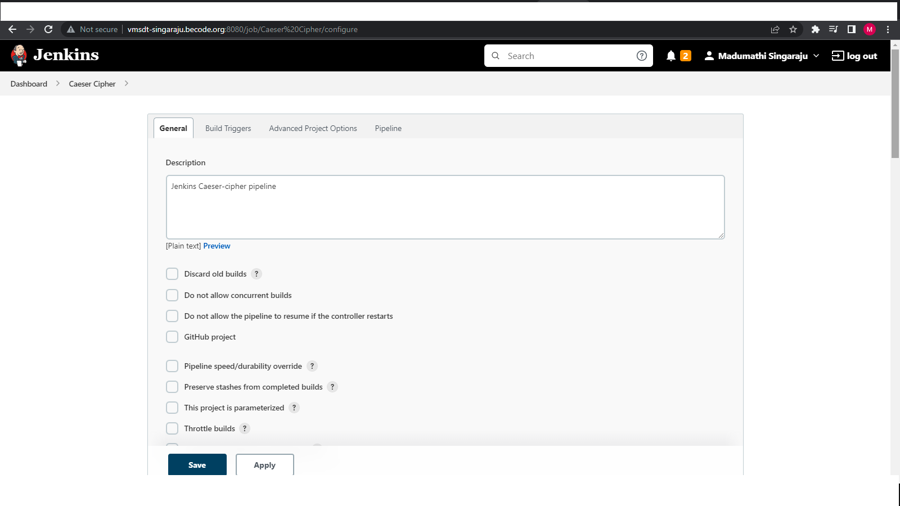
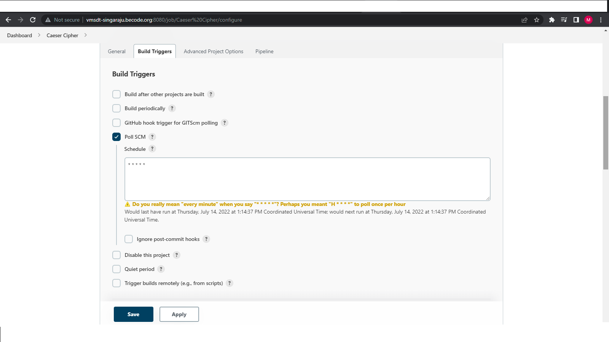
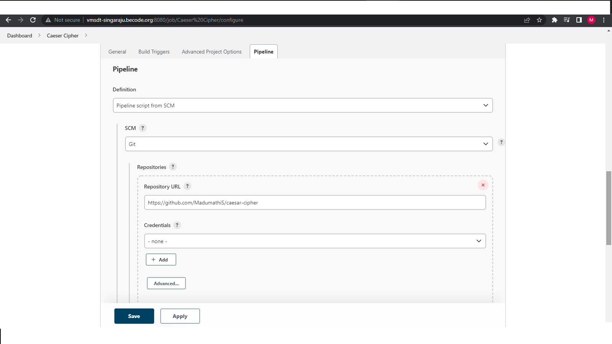
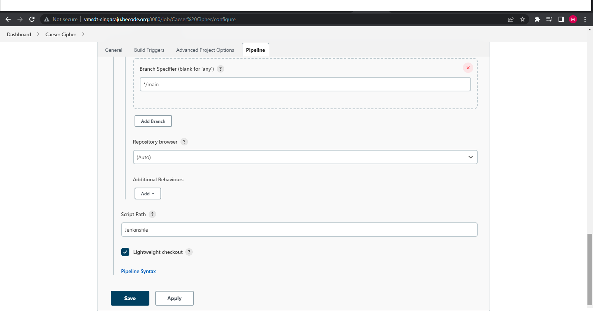

# Jenkins-Pipeline Example Caeser Cipher

Creeating a CI/CD pipeline using Gradle in Jenkins

For generating Tokens in git

[Git tokens](https://github.com/settings/tokens)

For releases:

Generate a release tag under release section of the repo

